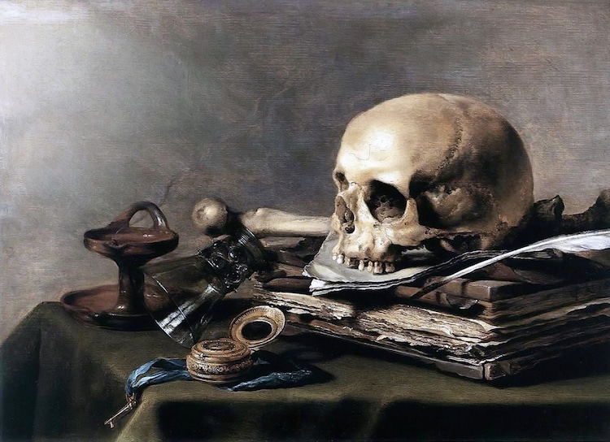

# Oversyn over resten av tida dokkar i London

| Veke | Dato       | Tema                               |
|:-----|:-----------|:-----------------------------------|
| 13   | 30. mars   | Nynorsk og språkhistorie           |
| 14   | påskeferie |                                    |
| 15   | påskeferie |                                    |
| 15   | 20. april  | **Presentasjon 2**                 |
| 16   | 27. april  | Romantikken og nasjonalromantikken |

# Oversyn over i dag

| Time  | Klokkeslett | Tema                               |
|:------|:------------|:-----------------------------------|
| 1     | 13:45-14:30 | 1.1. Quiz  1.2. Romantikken  1.3. Samanlikningsoppgåve |
| 2     | 14:30-15:15 | 2.1. Norsk språkdebatt på 1800-talet  2.2. Danomani, fornorsking, eller nytt språk?  2.3. Kva med samnorsk? |
| Pause | 15:15-15:35 |        |
| 3     | 15:35-16:20 | 3.1. Nynorsk grammatikk 3.2. Omsetjingsoppgåve  3.3. Gjennomgåing av omsetjing (Alternative oppgåver for dei med unntak.) |
| 4     | 16:20-17:00 | 4.1. Søknad  4.2. Sjølvstendig arbeid  4.3 Val av kva du søker på |

# Quiz

## 1

Kva for ei tid er kjent for sitt fokus på mennesket? (1p)

## 2

Kva for ei tid er kjent for denne symbolismen? Kva heiter denne symbolismen? (2p)

## 3

Kva for ei tid er kjent for sitt fokus på Gud? (1p)

## 4 

I kva for ei tid byrja debatten om fridommen til kvinner? (1p)

## 5

Kva for ei tid høyrer Ludvig Holberg til? (2p)

## 6

Kva for ei tid høyrer Mary Wollstonecraft til? (1p)

## 7

Kva for ei tid høyrer Caravaggio til? (1p)

Barokken (1p)

## 8

I kva tid hamra Martin Luther sine 99 tesar på kyrkjedøra? Kva heiter rørsla [bm. bevegelsen] som følgde denne hendinga? (2p)

## 9 

I kva tid skreiv Immanuel Kant at menneskjer er skuld i sin eigen umyndigheit når dei er late eller feige? (1p)

## 10

Kven fant opp essayet og i kva for ei tid fant dei det opp? (2p)

# Svar

## 1

Kva for ei tid er kjent for sitt fokus på mennesket? (1p)

Renessansen (1p)

## 2

Kva for ei tid er kjent for denne symbolismen? Kva heiter denne symbolismen? (2p)

Barokken (1p), Memento mori (1p)

## 3

Kva for ei tid er kjent for sitt fokus på Gud? (1p)

Barokken (1p)

## 4 

I kva for ei tid byrja debatten om fridommen til kvinner? (1p)

Opplysningstida (1p)

## 5

Kva for ei tid høyrer Ludvig Holberg til? (1p)

Opplysningstida (1p)

## 6

Kva for ei tid høyrer Mary Wollstonecraft til? (1p)

Opplysningstida (1p)

## 7

Kva for ei tid høyrer Caravaggio til? (1p)

Barokken (1p)

(0.5p for Renessansen)

## 8

I kva tid hamra Martin Luther sine 99 tesar på kyrkjedøra? Kva heiter rørsla [bm. bevegelsen] som følgde denne hendinga? (2p)

Renessansen (1p), Reformasjonen (1p)

## 9 

I kva tid skreiv Immanuel Kant at menneskjer er skuld i sin eigen umyndigheit når dei er late eller feige? (1p)

Opplysningstida (1p)

## 10

Kven fant opp essayet og i kva for ei tid fant dei det opp? (2p)

Michele de Montaigne (1p) i Renessansen (1p)

# Romantikken 

## Ein retur til kjensler

Den tyske, romantiske filosofen Friedrich Schelling skreiv at 

> Naturen er den synlige ånd, mens ånden er den usynlige natur.

Hugseregel: romantikken er atterfødinga av barokken utan det barokke fokuset på religion. 

<aside class='notes'>
- pietistisk (protestantisk) inderlighet, med hensikt å vekke sterke følelser overfor Gud
- pastoraldikting om idyllisk og vakker natur
- det som overgår, det som bare kan nås med følelser
- inspirasjon av panteismen, at gud er i alt
</aside>

## Kontrastar til opplysningstida og klassisismen

::: incremental

- Kunsten i **opplysningstida** kallast _klassisismen_
- Her gjeld det å representere verda presist—kunsten er ein _etterlikning_
- Regler er derfor viktige og skal følgjast korrekt 
- Kunstnarar er vitskapsfolk som studerer verda regelrett
- Kunsten i **romantikken** er eit ikkje ein etterlikning av verda, men heller eit uttrykk av kva ein kjenner inni seg—for eksempel når ein studerer verda, men ellers òg
- Kunstnaren er ein slags profet, eit «geni» som står skilt frå vanlege folk
- Lyrikk er den viktigaste sjangeren fordi den kan hinte til ting ein ikkje kan seie direkte
- Reglar er viktige i romantikken, men berre fordi ein trenger ein regel for å kunne bryte laus og skille seg ut—for å sprenge grensar og vere spontan

:::

## Kjenneteikn

- Idear
    - opprør med fornuft og rasjonalitet
    - attervending til natur og ånd
    - sentralisering av alle slags kjenslar [bm. følelser]
- Motiv
    - Naturen
    - Det å vere annerleies
    - Ånd 
Språkbruk
    - Rik på bilete, metaforar, og organiske referansar
    - Vagt, lite bokstaveleg
    - Brot på reglar
    - Lange, snirklande setningar—som eit 3D-bilete
    - Patos, patos, og enno meir patos

## Henrik Wergeland: *For trykkefriheden* (1840)

Hvor trives noget godt og skjønt  
og stort i tvang?  
Kvel engen – gresset blir ei grønt;  
bind ørnen, dør den på sin [stup];  
stans kilden, som med sang begynt  
har raskt sin gang,  
og den en giftig sump vil bli!  
Naturen hater, sterk og fri,  
all tvang.  
Kan åndens kilder, tankens flukt  
da tåle tvang?  
Skal sannhet [bare] stråle smukt,  
i eget hjerte innelukt,  
som jamrende Aladdins frukt  
i hulen trang?  
Nei, presse, løft din sterke arm!  
befri all verden i din harm  
fra tvang!  

<aside class='notes'>
- Korleis ville dette same poenget bli sagt i opplysningstida? Av Kant til dømes? 
</aside>

# Språkdebatten frå 1830-talet

## Ei kort tidslinje

::: incremental

Norsk språkhistorie
1. 500–700 Urnordisk
2. 700–1350 Norrønt
3. 1350–1525 Mellomnorsk
4. 1525–nå Moderne norsk

:::

## Moderne norsk

Moderne norsk er eit svært omgrep. Det handlar både om dansk, dialektar, bokmål, nynorsk, og alt i mellom—og utviklinga er sterkt påvirka av romantikken og etter kvart òg nasjonalromantikken. 

## 1830: språkdebatten byrjar. 

Tre perspektiv: 

1. Henrik Wergeland: gradvis fornorsking av dansk. 
2. P. A. Munch og Welhaven: halde fram med dansk. 
3. P. A. Munch (sarkastisk meint): heilt nytt språk. 

<aside class='notes'>
- På 1800-tallet var nordmenn flest bønder, og snakket forskjellige bygdedialekter. Embetsmannsstanden snakket dannet dagligtale, som lå nært opptil dansk: Mange av ordene i den dannede dagligtalen var danske, men uttalen og setningsbygningen var norsk. Embetsmannsstanden var eliten i landet, men de utgjorde kun en liten prosent av befolkningen, og representerte ikke «folk flest». Embetsmenne holdt gjerne til i byene, var høyt utdannet, gjerne som prester, offiserer eller jurister, mens det brede lag av folket tilhørte bondestanden. For bøndene var dansk et vanskelig fremmedspråk, og de hadde store problemer med å lære å lese, og med rettskrivning. De som utgjorde embetsmannsstanden syntes gjerne at bøndenes dialekter var sjarmerende, men mente samtidig at det var deres egen talemåte som representerte dannelse og kultur. Ikke så rart, kanskje, siden kulturelle impulser fra Europa kom til Norge via Danmark
</aside>

## Henrik Wergeland: fornorsking

::: incremental

1. Demokratisk argument: meir likskap gir fleire moglegheit til å delta. 
2. Nasjonalt argument: eiget språk gir kulturell sjølvstendigheit. 
3. Kunstnerisk argument: treng eit språk som passar norske kjensler og natur. 
4. Ord kan hentast tilbake, men ikkje grammatikk. 

:::

## Johan Sebastion Welhaven: danomani

::: incremental

1. Dansk er allereie etablert. 
2. Dansk språk hald fram kontakten vår med resten av Europa. 

:::

## P. A. Munch: danomani eller nytt språk

::: incremental

1. Dansk er allereie etablert. 
2. Dansk språk hald fram kontakten vår med resten av Europa. 
3. Me bør heller erstatte dansken heilt med eit nytt norsk språk dersom me likevel skulle fornorske han. Om me skal fornorske bør me gjere det ordentleg og vitskapeleg ved å endre på sjølve strukturen i språket, ved å studere korleis ein faktisk brukar språket i landet, ikkje berre endre nokre få ord til ein «dannet dagligtake» som nesten ingen brukar uansett. 

:::

<aside class='notes'>
- P.A. Munch argumenterte for at det ikkje var vetenskaplegt å stappe inn nye ord på magekjensle, når dei ikkje passar inn nokon plass i flest folk sin tale. 
- Han meinte òg at ein ikkje kan danne eit nytt språk med å ta ut eller leggje til ord, at det ein må gjere er å endre setningsstrukturen og korleis ein brukar språket. 
</aside>

## Debatt

Kven syntest dokker har det beste argumentet? 

1. Wergeland: fornorsking. 
2. Welhaven: danomani. 
3. Munch: danomani eller nytt språk. 

## Meir debatt

Kan ein endre ett språk ved å endre på orda? 

# 1840-talet: frå eventyr til ordbok

## Byrjinga på eit eventyr

Asbjørnsen og Mo publiserte sin eventyrsamling på ein fornorska dansk, med dansk base tillagt norske ord og fraser som representerte dei lokale dialektane sine kjenneteikn. 

## Ivar Aasen: vitskaplegt nytt språk

- Mellom 1842 og 1846 var Aasen kontinuerleg på granskingsferd rundt om i landet, først og fremst på Vestlandet og i fjellbygdene austpå, men også nordafjells. 
- I 1848 publiserte han ei grammatikkbok for landsmål (altså det som nå er nynorsk).
- I 1850 publiserte han ei ordbok for landsmål. 

<aside class='notes'>
- 5. august 1813, Ørsta, Sunnmøre
- Hans Reise-Erindringer og Reise-Indberetninger 1842-47 er utgjevne av Halvdan Koht i 1917. Gjennom dei kan vi følgje han frå bygd til bygd. Dei haldningane han gjev til kjenne til lokal variasjon i sed og skikk, og ikkje minst i språk, gjev interessante kulturhistoriske opplysningar frå samtida. 
- Aasen var etter dette en svært populær mann i Oslo. I 1851 besluttet Stortinget å gi Aasen et livsvarig stipend. Fra nå av hadde han økonomisk frihet til å jobbe med det han selv ville. Nå tok arbeidet med prosjektets andre del til for alvor. Å skape et nytt, norsk, skriftspråk – det som Aasen selv kalte landsmål, og som i dag heter nynorsk. 
- Aasen var mot valfridom i språket
</aside>

## Knud Knudsen: vitskapleg fornorsking

::: incremental

- Ortofoni: skriv som du snakkar. 
- Som _kven_ snakkar? Dei som har «danna dagligtale». 
- Skriv me som me snakkar?§ 

:::

<aside class='notes'>
- Det store målet for Knudsen var å bytte ut de bløte konsonantene bdg, med de harde konsonantene **ptk**. Han mente altså at vi burde skrive Jeg løp ut på gaten mens jeg spiste kake, og ikke Jeg løb ud på gaden mens jeg spiste kage, som på dansk. De harde konsonantene ble først innført i 1907, etter Knudsens død. 
- Teaterspråket: Så sent som på 1850-tallet hentet man skuespillere fra Danmark til Kristiania fordi mange oppfattet den norske uttalen som støtende. Knudsen kjempet aktivt mot denne praksisen, og fikk støtte av Bjørnson og Ibsen
- Knudsen var for valfridom i språket
</aside>

## Døme av ortofoni

::: incremental

- Stum e ble avskaffet: troe ble til tro, faae ble til faa 
- Dobbeltvokal ble avskaffet: Miil ble til Mil, Huus til Hus. 
- ph ble til f: Philosoph ble til Filosof
- c, q, ch ble til k: Consul ble til Konsul, qualm ble til kvalm, Charakteer ble til Karakters

:::

# 1869–: frå ordbok til lov 

## Språksituasjonen

- **Embetsmannsklassen** ville holde på et tilnærmet dansk som skriftspråk, men det ble klart for stadig flere at dette slaget allerede var tapt. For å unngå å kalle språket dansk, ble det kalt det almindelige Bogsprog eller dansk-norsk. Også danskene oppfattet dette språket som noe forskjellig fra dansk, særlig når det gjaldt ordforråd og setningsbygning.
- **Knud Knudsen** arbeidet videre med å fornorske skriftspråket, ved å gjøre det mer likt dannet dagligtale. Han fikk hjelp i dette arbeidet fra diktere og språkforskere, og senere ble også politikerne interessert. Denne retningen tok etter hvert over for det almindelige Bogsprog, og kalles **riksmål**.
- **Ivar Aasens** **landsmål** ble mer og mer populær blant vanlige folk, og ble brukt i stadig flere sammenhenger. I 1868 ble **landsmål**sforlaget Det Norske Samlaget opprettet, Arne Garborg ga ut avisen Fedraheimen på **landsmål**, og det nye testamentet ble oversatt til **landsmål** i 1889. 

<aside class='notes'>
- Knudsens riksmål vinn over det almindelige Bogsprog. 
- Aasens landsmål overlever òg. 
</aside>

## Nye lover

::: incremental

- 1878 «barnas eget talemål»
- 1885 «jamstillingsvedtaket»
- 1892 «målparagrafen»

:::

<aside class='notes'>
- «barnas eget talemål»: alle skal lære seg det som er nærmast sånn dei snakkar
- «jamstillingsvedtaket»: landsmål og riksmål skal stå likt i lova
- «målparagrafen»: lokalsamfunnet seier kven som skal bruke kva
- https://kublakan.no/oppgaver-spraakhistorie/
</aside>

## Ny lærebok

::: incremental

- Nordahl Rolfsens *Læsebog for Folkeskolen* lærte folk opp feil! Både feil i forhold til rettskrivningsreglar og i forhold til sine eigne påstandar om korleis ein skal skrive—sjølvmotseiande, altså. 
- Norskar var då elendige på å skrive. Staten ba om ei løysing, men dei mange forslaga vart alle for radikale for einigheit. 
- Løysinga kom i 1907 då staten valfridom i skriftspråket. 
- Derfor har me nå to likestilte skriftspråk med valfridom i kvart. 

:::

# Debatt: samnorsk

# [Nynorsk](https://kublakan.no/wp-content/uploads/2018/01/nynorskpowerpoint-Videoteket.pdf)

## Kva kan nynorsk gjere for meg? 

<iframe width="560" height="315" src="https://www.youtube.com/embed/s7olTWEIwAI" title="YouTube video player" frameborder="0" allow="accelerometer; autoplay; clipboard-write; encrypted-media; gyroscope; picture-in-picture" allowfullscreen></iframe>

## Omsetjingsoppgåve side 26

## Send Sara, Jasmine, og Yen til grupperom for å lage ein kort presentasjon

https://kublakan.no/norsk-sprak-fra-norron-tid-til-i-dag/
https://www.vg.no/nyheter/meninger/i/QoAJz8/sanna-sarromaa-det-norske-spraaket-er-en-vits
https://ndla.no/nn/subject:1:50dfc86d-6566-4a45-a531-d32b82e8bfa1/topic:3:fa404de7-b027-4a38-8d23-33493a3a9a69/topic:1:6afe2e2f-042d-444d-993e-cc3efa3cbf2c/resource:dbd4cde9-de64-4d42-a637-8d030a5157d0
https://ndla.no/subject:1:50dfc86d-6566-4a45-a531-d32b82e8bfa1/topic:3:fa404de7-b027-4a38-8d23-33493a3a9a69/topic:1:6afe2e2f-042d-444d-993e-cc3efa3cbf2c/resource:93968862-f716-4286-a9fa-d1349cc5a1cb
https://www.youtube.com/watch?v=s7olTWEIwAI

# Presentasjon 2: Søknad

Me skal øve ennå meir på retorikk. 

Me skal samstundes røyne oss på noko ekstremt vektig for dokker: å skrive ein god søknad. 

Dokker kan velje om dokker vil skrive ein **jobbsøknad** eller ein **studiesøknad**. 

## Framgangsmåte

Draum deg fram to-tre år. Kva for ein jobb eller studie har du? 

1. Vel ein jobb eller studie og finn ut kva den går ut på, samt kva den krev av deg. 
2. Skriv ned **tre forteljingar** om deg sjølv som viser korfor du er den rette kandidaten for denne jobben eller studien. 
    1. To av dei skal vere sanne. 
    2. Ein av dei skal vere usann. 
3. Du skal presentere punkt 1 og 2 for læraren og ein lita gruppe frå klassen, som om det var eit jobb- eller studieintervju. Du skal altså prøve å _lure_ både læraren og gruppa. 
4. Både læraren og klassen får stille eit spørsmål kvar for å luke fram sanninga. Førebu [bm. forbered] deg! 

I dag skal me jobbe med punkt 1 og 2 sånn at du er klar til 20. april. 

# Kva er eit språk? 

<aside class='notes'>
- Ordkjemi? 
- Ein levemåte?
</aside> 

## Kva er *ditt* språk? 

Me skal snart skrive nokre setningar der me røyner [bm. prøver] å vise kva som er unikt med vårt eiget språk--anten når du skriv eller når du snakkar. 

Me skal gje døme [bm. eksempel] og stille dei i kontrast med korleis andre ville skrive i same høve [bm. situasjon]. 

## **Til dømes** [bm. for eksempel]

Sjå ark! 

## Dokkar tur: skriv kort om kva ditt språk er. 

::: incremental

1. Skriv ein kort tekst der du _viser_ fram språket ditt gjennom særeigne ord, stavemåtar, ordtak, og uttrykk. 
2. Du må skrive _på_ norsk, anten bokmål eller nynorsk, men du bør skrive _om_ noko som dei andre her ikkje veit så godt dersom du kan!
4. Eg forventar at alle skriv **minst tre setningar** og **minst tre døme** [bm. eksempler]. 
5. Alle ord og uttrykk er lov, så lenge dei faktisk er sjeldne og særeigne for ditt språk! 
6. Eg kommer til å plukke to eller tre av dokker til å lese opp det dokker skriv. 
7. «Bonuspoeng» til dei som viser meg noko eg ikkje har sett før! 

:::

<aside class='notes'>
- Det kan og vere ein ny bruk av ein gamal frase! 
</aside>

## Bør alt dette vere lov på norsk? 

<aside class='notes'>
- Skal det vere valfridom i språket? 
- Bør språket og språkutviklinga blir styrt i stor eller lita grad?
- Er det talespråket eller skriftspråket som er viktigast for kva veg språket utviklar seg?
- Er nokon språk eller språkvariantar finare, reinare eller viktigare enn andre?
Kven bestemmer over språket – språkbrukarane eller språkekspertar og styresmakter?
- Er det fleirtalet som bør bestemme over utviklinga til språket?
Kva er den viktigaste oppgåva til språket?
- Er det viktig med eit eige nasjonalspråk?
</aside>