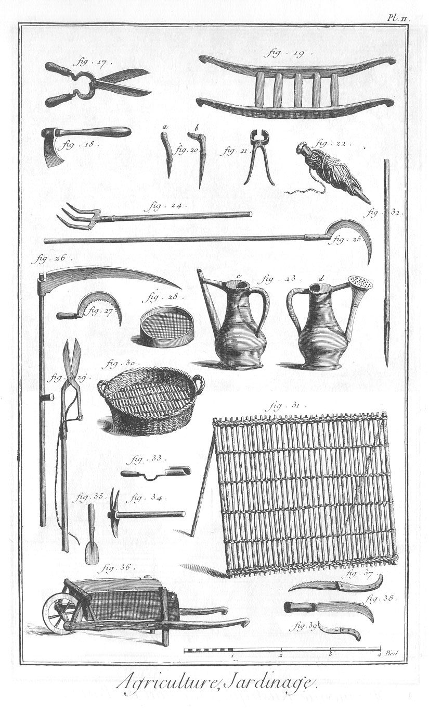

# Informasjon

1. **Google Classroom**
2. **Nettside**: [hsherl.github.io/norsk](https://hsherl.github.io/norsk). 
3. **Epost**: [h.sherling@wlc.ac.uk](mailto:h.sherling@wlc.ac.uk). 

# Opplysningstida

- lese tekstar som bryt med forventningane til epoken, som skillingsviser og drikkeviser
- drøfte korleis forfattarskapen til Ludvig Holberg har relevans for oss i dag

## «Was Ist Aufklärung?» (nn. Kva er opplysning?)

> Opplysning er menneskets frigjøring fra en selvforskyldt umyndighet. Umyndighet består i manglende evne til å bruke sin forstand på egen hånd. Denne umyndighet er selvforskyldt når årsaken ikke er mangel på forstand, men beror på manglende besluttsomhet og mot til å ville greie seg uten å bli ledet av andre. Sapere aude! Ha mot til å bruke din egen forstand. Det er opplysningens valgspråk. (Immanuel Kant)

<aside class='notes'>
- Opplysning, framsteg og offentlegheit. 
- Les Kant sin tekst nå. 
- Sapere aude = våg å vite. 

1. Med opplysning meiner vi altså trua på at mennesket kan utvikle seg gjennom å bruke fornufta si. Slik legg opplysningstida grunnlaget for viktige verdiar i det moderne demokratiet: ytringsfridom, trykkefridom, religionsfridom og likskap for loven. I dag seier vi gjerne at kunnskap er makt, og med det understrekar vi at kunnskap gir oss moglegheit til å påverke eigne liv og delta i demokratiet
2. Dermed er vi over på det andre stikkordet, nemleg framsteg. Tidlegare trudde ein at verda var uforanderleg, eller at høgdepunkta i historia låg bak oss, og at forandring var det same som forfall. Men i opplysningstida voks det fram ei tru på at vitskap, teknologi og økonomisk vekst fører til eit betre samfunn
3. For at idear som opplysning og framsteg skal utvikle seg, må dei nye tankane bli formidla og diskuterte. Da trengst det medium som legg til rette for det vi kallar ei offentlegheit, eit fellesskap der ein kan diskutere samfunnsspørsmål. Og denne offentlegheita må ikkje bli sensurert av for eksempel konge eller kyrkje. På 1700-talet voks marknaden for trykte bøker, tidsskrift og aviser. Utviklinga av desse nye media hadde stor betydning for spreiinga av opplysningsideane og dermed også for revolusjonar og utvikling av demokrati. Samtidig er det viktig å hugse at det opplysningstida forstod som vitskapleg og demokratisk, var fjernt frå slik vi forstår dei i dag. Den amerikanske grunnloven var sterkt inspirert av opplysningsidear, men personen som skreiv han, eigde slavar. Og i Noreg fekk kvinner stemmerett først i 1913

1. Opplysning: «Ha mot til å bruke din eigen forstand!» var eit viktig valspråk i opplysningstida. Bruker menneske i dag kunnskap og fornuft til å ta eigne val?
2. Framsteg: Vil du seie at vår eiga tid er prega av ei tru på framsteget, for eksempel teknologisk, vitskapeleg, politisk, kulturelt eller miljømessig?
3. Offentlegheit: Kva er dei viktigaste media i offentlegheita i dag? I kva grad vil du seie at mediekulturen oppfordrar til sjølvstende og fornuft?
</aside>

# Kvar og når: 1700-talet; 1688-1789

[Tidslinje.](https://intertekst.fagbokforlaget.no/read_container/6dc3077a-af13-4279-aded-3136408559cc)

- Byrjar med den **engelske revolusjonen** i 1688. 
- Innimellom var den **amerikanske revolusjonen**, i 1776. 
- Slutar med den **franske revolusjonen** i 1789. 
- 1700-talet var ein vekstperiode i Danmark-Noreg. 

<aside class='notes'>
- Svært forenkla kan vi seie at 1700-talet liknar på renessansen, mens 1600-talet liknar på mellomalderen. Som vi såg i kapittel 6, var livet i barokken sterkt prega av religiøs tru, akkurat som i mellomalderen. Dei fremste tenkarane og vitskapsmennene i renessansen utfordra læra og tankemonopolet til kyrkja, men utan å fornekte at Gud eksisterte. Humanismen på 1700-talet gjekk eit skritt vidare. Kunnskap og vitskapleg tenking blei ideala for mange, og omgrepet ateisme blei no tatt i bruk om trua på ei verd utan Gud. Likevel var religionen framleis viktig for dei fleste. Ikkje minst gjaldt dette i Danmark-Noreg, der kristendommen på mange måtar blei styrkt på 1700-talet. I 1730-åra blei det blant anna straffbart å skulke gudstenester, og konfirmasjonen blei obligatorisk.
- Coffee, tea, chocolate, tobacco, and new foods. 
- 1755 Lisbon earthquake
- honest, inquisitive, open
- cafe, salon
- Denis Diderot: all things must be examined
- Worldly aims, not spiritual
- The question of God, the imagination of a better world
- Slaveri
- Lærdom fra verdensreiser
- Adam Smith and mercantilism, the idea of the free market and self-interest
- Jean-Jacque Rosseau's The Social Contract: man is born free but everywhere he is in chains; mannen er født fri men overalt er han i lenker
- Forfølgelse på vei bort… på noen områder. 
- Født til makt, arv. 
- Tomme for penger, skatt trengs for hærer og kriger og overlevelse for kongen og aristokratiet (adelklassen). 
- Robespierre. Fransk revolusjon. 
    - Desimalsystemet
</aside>

# Encyklopedien

> Kva er Wikipedia? Korfor blei det starta? Bruk 5 minutter på å finne ut korleis Wikipedia funkar. 

## Diderot

<aside class='notes'>
- Internettrevolusjonen tok ikkje av før det nærma seg år 2000, men sjølve ideen om å samle all faktakunnskapen i verda er mykje eldre. I Europa kan vi seie at det starta i opplysningstida, og sentralt stod utviklinga av den franske encyklopedien. På 30 år kom det ut 35 bind av det store oppslagsverket. Leidd av forfattaren Denis Diderot (1713–1783) bidrog nesten 150 mann til gigantverket. Blant desse var nokre av dei fremste franske opplysningsfilosofane: Charles de Montesquieu (1689–1755), François-Marie Voltaire (1694–1778) og Jean-Jacques Rousseau (1712–1778).
- Diderot organiserte encyklopedien alfabetisk som eit oppslagsverk. Innhaldet var dominert av beskrivande tekstar med faktaopplysningar. Mange vitskaplege nyvinningar, for eksempel den moderne spinnemaskinen, blei beskrivne på ein enkel måte. Men det fanst også meir vurderande og kommenterande tekstar, særleg om kunstnariske og filosofiske emne. Mange av desse artiklane er så subjektive og politiske at vi i dag vil tenke at dei bryt med leksikonsjangeren.​
- Encyklopedien gir eit tydeleg inntrykk av det moderne verdsbildet til opplysningsfilosofane. Mange kjøpte det enorme oppslagsverket, og det betydde mykje for tilgangen til informasjon, særleg blant menneske med høgare utdanning.
- Systematisk leksikon for vitenskapen, kunsten, og håndverken. 
</aside>

## Aviser og tidsskrift

<aside class='notes'>
- Interessa for naturvitskap, filosofi og politikk førte ikkje berre med seg oppslagsverk og vitskaplege avhandlingar for spesielt interesserte. Etter kvart prega opplysninga større delar av samfunnet, og vi fekk fleire arenaer for diskusjonar om litteratur, kunst, politikk og vitskap. Ein viktig del av denne utviklinga var oppblomstringa av tidsskrift og aviser. I første omgang var innhaldet svært blanda, frå skandalehistorier og sladder til små avhandlingar om aktuelle saker. Det var først på 1800-talet avisene blei drivne av nyheiter.
- Dei første avisane kom ut i 1665 under dei religiøse krigane. 
</aside>

## Religiøst lesestoff og skolegang

<aside class='notes'>
- I Noreg dominerte først og fremst religiøse tekstar tekstkulturen. 
- Ved innføringa av skoleloven av 1739 blei leseopplæring obligatorisk for alle barn frå sju år. Elevane las berre religiøse tekstar i skolen. 
- Om folk utan høgare utdanning las bøker heime, las dei Bibelen og andre religiøst oppbyggelege bøker. 
</aside>

# Vår tid

Kva er vår tid? 

<aside class='notes'>
Det blir framvisning på dette temaet. Ikkje neste gong, men gongen etter det. 

1. Bruk kvart retoriske grep. 
2. Samanlikn (både likheit og kontrast) vår tid med en epoke vi har snakt om. 
3. Kva er ein typisk tekst i dag? 
4. Kven er eit typisk førebilete i dag?
</aside>

## Skrivefristelser

# Skriveoppgåve 2

<aside class='notes'>
- Me må planlegge denne. 
</aside>

## Oversyn

| Veke | Dato       | Tema            |
|:-----|:-----------|:----------------|
| **8**    | **i dag**      | **opplysningstida** |
| 9    | 2. mars    | opplysningstida |
| 10   | 9. mars    | **framvisning 1** |
| 11   | 18. mars   | **skriveoppgåve 2** |
| 12   | 23. mars   | romantikken |
| 13   | 20. mars   | nasjonalromantikken |
| 14   | påskeferie |  |
| 15   | påskeferie |  |
| 15   | 20. april  | **framvisning 2**   |
| 16   | 27. april  | språkhistorie |

# Klaging og retting

1. Fiks feil som eg har kommentert på i teksten din.  
2. Skriv eit omtrent eit avsnitt på sluten av teksten med tittel «klage». 
3. Der kan du seie korfor du syns du skal ha ein høgare karakter (eller, om du er gal, korfor du syns du skal ha lågare karakter…). 
4. Dersom du har ordna opp i feil og argumentert godt, så skal du få ein betre karakter. 